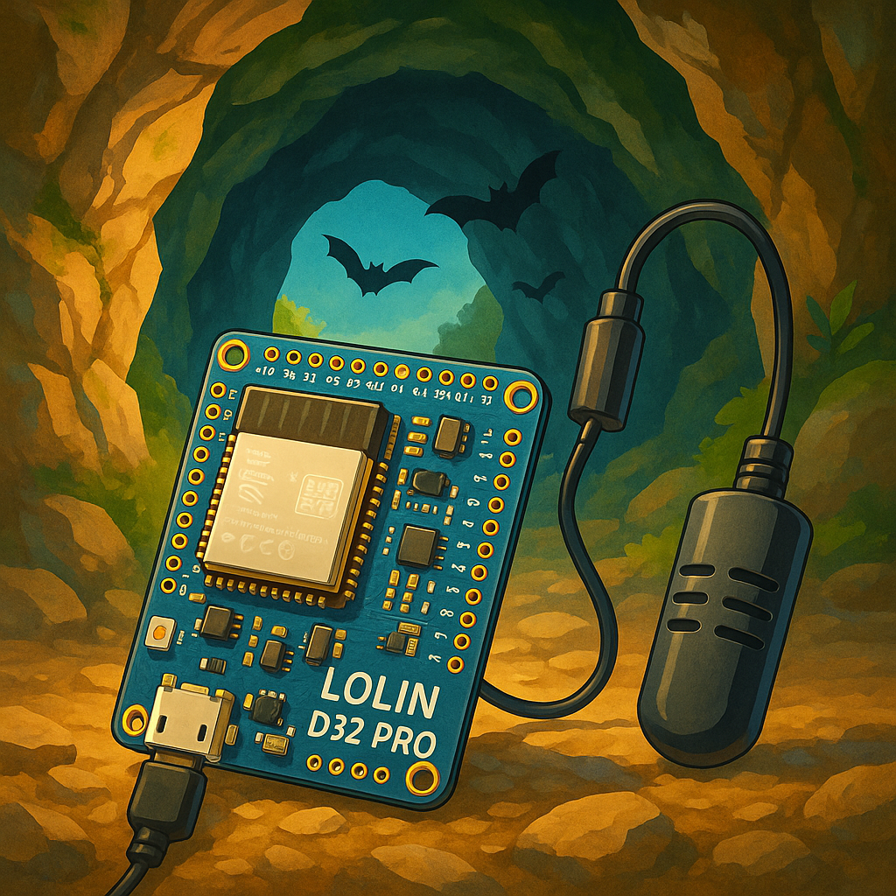

# 🦇 Projet de Datalogger Température & Humidité pour Cavités à Chiroptères



** [Angular Chiro App](https://github.com/themaire/angular_chiro_app) - PWA pour la récupération des données via Bluetooth BLE
>
> 💡 **Qu'est-ce qu'une PWA ?**  
> Une Progressive Web App (PWA) est une application web qui fonctionne comme une app mobile native. Elle peut être installée sur smartphone, fonctionne hors-ligne, accède aux APIs natives (Bluetooth, géolocalisation...) et offre une expérience utilisateur fluide. Pas besoin de passer par les stores d'applications !

## 🎯 Objectif

Concevoir et déployer un **datalogger autonome et discret** permettant la mesure **long terme** de la **température**, de l’**humidité** et de la **pression atmosphérique** dans des **cavités naturelles** ou souterraines **occupées par des chauves-souris (chiroptères)**.

L’objectif est de récolter des données environnementales précises, sans perturber les conditions locales, afin de mieux comprendre les dynamiques microclimatiques des sites d’hivernage.

## 🧪 Contexte scientifique

Dans les études de suivi des chiroptères, la précision des mesures et la **non-perturbation du milieu** sont essentielles. De simples variations dues à l'ouverture d’un boîtier peuvent créer des artefacts dans les séries de données, voire impacter le comportement des individus. Il est donc nécessaire que :

- L’appareil soit **étanche et totalement autonome**
- Les mesures soient **horodatées** avec précision
- Les données soient **récupérables sans contact physique**

## ⚙️ Spécifications techniques du dispositif

### Matériel principal

| Composant | Rôle | Remarques |
|----------|------|-----------|
| **LOLIN/Wemos D32 Pro (ESP32)** | Microcontrôleur principal | Faible consommation, BLE intégré, slot microSD |
| **BME280** | Capteur de température, humidité, pression | Haute précision, I2C |
| **DS3231 RTC** | Horloge temps réel | Pour horodatage même en deep sleep |
| **Carte microSD** | Stockage local des mesures | Format `.csv` lisible par tableur |
| **Capteur capacitif (ex. TTP223)** | Déclencheur sans contact | Permet d’activer le mode "transfert de données" |
| **Batterie LiPo 3.7V (≥1000mAh)** | Alimentation autonome | Autonomie estimée à plusieurs semaines/mois |
| **Diviseur de tension ou MAX17048** | Suivi du niveau de batterie | Pour surveiller l'autonomie via le programme |

### Fonctionnement logiciel

#### 🔁 Mode normal (acquisition)

- Réveil toutes les X minutes (configurable)
- Lecture des capteurs BME280 + tension batterie
- Horodatage via RTC
- Enregistrement sur carte SD au format CSV
- Remise en sommeil profond (deep sleep)

#### 🔋 Deep Sleep - Optimisation énergétique

Le datalogger utilise le **mode deep sleep** de l'ESP32 pour maximiser l'autonomie :

**⚡ Consommation mesurée :**

- **Mode actif** (mesure + écriture tampon) : ~80-120 mA pendant 1-2 secondes
- **Mode deep sleep** : ~10-20 µA (microampères)
- **Économie d'énergie** : >99% du temps en veille

**🧪 Test d'autonomie réel :**

- **Batterie testée** : LiPo 150mAh seulement
- **Configuration** : Mesures toutes les 5 secondes
- **Résultat** : **3700 mesures** jusqu'à épuisement total
- **Durée** : ~5 heures de fonctionnement continu (3700 × 5s)

**📊 Projections d'autonomie :**

Basées sur les résultats réels, voici les estimations d'autonomie selon la batterie et l'intervalle de mesure :

| Batterie | Intervalle 5s | Intervalle 30min | Intervalle 1h |
|----------|---------------|------------------|---------------|
| **150mAh** | ~5h (3700 mesures) | **~2 mois** | **~4 mois** |
| **500mAh** | ~17h | **~7 mois** | **~14 mois** |
| **1000mAh** | ~33h | **~14 mois** | **~28 mois** |
| **2000mAh** | ~67h | **~28 mois** | **~56 mois** |

> 🚀 **Performance exceptionnelle :** Avec une simple batterie de 150mAh et un intervalle de 30 minutes, le datalogger peut fonctionner **2 mois en continu** !

**📊 Gestion intelligente des données avec tampon flash :**

Le datalogger utilise un système de **tampon flash interne** pour optimiser l'utilisation de la carte SD :

1. **Stockage temporaire** : Les mesures sont d'abord stockées dans la **flash interne de l'ESP32** (partition SPIFFS de 15MB)
2. **Économie d'énergie** : La carte SD n'est activée que lors du **flush périodique**
3. **Flush automatique** : Transfert des données vers la SD toutes les **500 mesures** (optimisé)

**🕒 Timing avec mesures toutes les 5 secondes :**

- **Mesures 1-499** : Stockées dans le tampon flash
- **Mesure 500** : Déclenchement du flush → activation SD → transfert des 500 mesures → extinction SD
- **Cycle suivant** : Reprend avec le tampon vide

**⚡ Économie d'énergie réalisée :**

- **Sans tampon** : SD activée à chaque mesure (5s) = 720 activations/heure
- **Avec tampon** : SD activée toutes les 500 mesures = 1 activation toutes les **42 heures**
- **Réduction** : **99.8% d'activations SD en moins** = autonomie considérablement prolongée

**🔍 Monitoring dans les logs :**

```text
📊 Tampon: 499/500 mesures
📊 Tampon: 500/500 mesures
🔄 Seuil atteint - flush vers la carte SD...
📊 Flush de 500 mesures vers la SD
✅ 500 lignes copiées vers la SD
🧹 Tampon flash vidé
✅ Flush réussi - tampon vidé
```

**💾 Fiabilité des données :**

- Données sécurisées dans la flash interne (persistante après coupure)
- Mode dégradé automatique : écriture directe sur SD si tampon indisponible
- Aucune perte de données même en cas de problème SD temporaire

**⚡ Économie d'énergie réalisée :**

- **Sans tampon** : SD activée à chaque mesure (5s) = 720 activations/heure
- **Avec tampon** : SD activée toutes les 500 mesures = 1 activation toutes les **42 heures**
- **Réduction** : **99.8% d'activations SD en moins** = autonomie considérablement prolongée

- Mode actif : ~80 mA
- Deep sleep : ~10 µA (8000x moins !)

**� Feedback visuel LED :**

Le datalogger intègre un **système de feedback LED** pour monitorer son fonctionnement :

- **1 clignotement** : Mesure ajoutée au tampon flash
- **10 clignotements rapides** : Flush des données vers la carte SD
- **LED éteinte** : Mode deep sleep (économie d'énergie maximale)

Ce système permet de vérifier visuellement que l'appareil fonctionne sans perturber son cycle de sommeil.

**💡 Innovation RTC : Compteur persistant entre deep sleeps**

🚀 **Pourquoi c'est techniquement stylé :**

La plupart des dataloggers "oublient" combien de mesures ils ont effectuées à chaque réveil. Ce datalogger utilise la **RTC Memory** de l'ESP32 pour maintenir un **compteur global persistant** !

**🔧 Implémentation technique :**
```c
// Variable stockée en RTC Memory - survit au deep sleep !
RTC_DATA_ATTR int cycle_counter = 0;

// À chaque réveil :
cycle_counter++;  // Le compteur continue de compter !
ESP_LOGI(TAG, "📊 Cycle de mesure #%d", cycle_counter);

// L'ID est utilisé comme première colonne du CSV
add_to_flash_buffer(cycle_counter, datetime_str, temp, humidity);
```

**📄 Format CSV enrichi :**

Le fichier CSV généré contient maintenant un **ID unique croissant** pour chaque mesure :

```csv
ID,DateTime,Temperature_C,Humidity_%
1,1672531200,18.5,85.0
2,1672531205,18.6,85.2
3,1672531210,18.7,85.4
...
1247,1672535435,19.2,86.1
```

**✨ Avantages uniques :**

- **Numérotation continue** : Cycles #1, #2, #3... même après des semaines
- **ID unique dans CSV** : Chaque mesure a un identifiant permanent et croissant
- **Diagnostic précis** : "Le datalogger a effectué exactement 1247 mesures"  
- **Détection de pertes** : Si l'ID saute de 100 à 110, on sait que 9 mesures manquent
- **Consommation nulle** : La RTC Memory ne consomme que quelques µA
- **Fiabilité totale** : Reset uniquement lors d'un redémarrage complet

**📊 Dans les logs :**

```text
⏰ Réveil du deep sleep (timer) - Cycle #1247
📊 Compteur RTC persistant: 1246 ✨ (survit depuis le début!)
📊 Cycle de mesure #1247
💾 CSV: ID=1247, T=19.2°C, H=86.1%
```

> 💡 **Magie technique :** Même après 1000 réveils de deep sleep, le système sait parfaitement qu'il en est à sa 1000ème mesure !

**�🔄 Cycle de fonctionnement avec compteur persistant :**

```text
🚀 Démarrage initial du système - Reset du compteur
📊 Compteur RTC persistant: 0
📊 Cycle de mesure #1
💡 LED: 1 clignotement (mesure ajoutée au tampon)
🌡️  Mesure: T=18.7°C, H=85.4%
� Mesure stockée dans le tampon flash
📊 Tampon: 1/500 mesures
💤 Entrée en deep sleep pour 5 secondes...
    [5 secondes plus tard - REDÉMARRAGE COMPLET]
⏰ Réveil du deep sleep (timer) - Cycle #2
📊 Compteur RTC persistant: 1
📊 Cycle de mesure #2
💡 LED: 1 clignotement (mesure ajoutée au tampon)
🌡️  Mesure: T=18.9°C, H=85.8%
� Tampon: 2/5 mesures
    [... cycles 3, 4...]
📊 Cycle de mesure #5
📊 Tampon: 5/5 mesures
🔄 Seuil atteint - flush vers la carte SD...
💡 LED: 10 clignotements rapides (flush SD)
✅ Flush réussi - tampon vidé
💤 Entrée en deep sleep pour 5 secondes...
    [cycle se répète avec compteur persistant...]
```

**🎛️ Configuration optimisée :**

- **Délai actuel** : `DEEP_SLEEP_DURATION_SEC = 5` (pour tests rapides)
- **Suggestions déploiement** :
  - **30 minutes** (1800s) : Monitoring climatique standard - **Autonomie 2+ mois**
  - **1 heure** (3600s) : Surveillance long terme - **Autonomie 4+ mois**
  - **6 heures** (21600s) : Études saisonnières - **Autonomie 2+ ans**
- **Tampon flash** : `BUFFER_FLUSH_THRESHOLD = 500` (optimisé pour autonomie)

**🧠 Innovations techniques :**

- **RTC Memory** : Compteur de cycles persistant entre les deep sleeps
- **Partition SPIFFS** : Tampon flash de 15MB pour optimiser l'écriture SD
- **Hot-plug SD** : Gestion robuste des déconnexions/reconnexions à chaud
- **Feedback LED** : Monitoring visuel sans perturbation du cycle de sommeil

**🔢 Compteur de cycles persistant (RTC Memory) :**

Innovation technique unique : le datalogger maintient un **compteur de mesures global** qui **persiste entre tous les cycles de deep sleep** !

- **Stockage RTC** : Variable `cycle_counter` stockée dans la RTC Memory de l'ESP32
- **Survit au deep sleep** : Contrairement à la RAM classique, la RTC Memory conserve ses données
- **Consommation ultra-faible** : La RTC Memory ne consomme que quelques µA
- **Redémarrage automatique** : Reset du compteur uniquement lors d'un redémarrage complet (power-on)

```c
// Innovation technique : persistance RTC
RTC_DATA_ATTR int cycle_counter = 0;  // Survit au deep sleep !
```

**🎯 Intérêt pratique :**

- **Traçabilité absolue** : Chaque ligne CSV a un ID unique et croissant depuis le début
- **Diagnostic avancé** : Permet de savoir exactement combien de mesures ont été effectuées
- **Détection de pertes** : Identification immédiate des données manquantes (trous dans la séquence)
- **Analyse de continuité** : Vérification de l'intégrité des données collectées
- **Récupération intelligente** : En cas de problème SD, on sait exactement combien de données sont perdues

> 💡 **Pourquoi c'est stylé :** La plupart des dataloggers perdent cette information à chaque réveil. Ici, même après 1000 cycles de deep sleep, le système "sait" qu'il en est à sa 1000ème mesure ET l'enregistre dans le CSV !

**🛡️ Sécurité des données :**

- Chaque fichier CSV est fermé immédiatement après écriture
- Le deep sleep provoque un redémarrage complet qui nettoie automatiquement toutes les structures
- Récupération automatique de la carte SD à chaud
- Pas de corruption possible grâce au redémarrage propre de l'ESP32

#### 🔄 Gestion robuste de la carte SD (Hot-Plug)

Le système gère intelligemment les insertions/retraits de carte SD :

**🔍 Détection automatique :**

- Détection immédiate d'une déconnexion lors d'une écriture
- Passage automatique en mode "sans carte SD"
- Messages explicites dans les logs

**⚡ Récupération automatique :**

- Tentative de récupération toutes les 25 secondes (5 cycles)
- Test de fonctionnalité avant reprise d'écriture
- Gestion sécurisée du bus SPI (pas de crash)

**📊 Comportement observé :**

```text
💾 Données sauvegardées sur SD
[Retrait carte à chaud]
❌ Impossible d'ouvrir le fichier CSV
🔌 Carte SD déconnectée détectée - démontage...
⚠️  Carte SD non disponible - données non sauvegardées
[Réinsertion carte]
🔍 Tentative de récupération de la carte SD...
🎉 Carte SD récupérée avec succès!
✅ Test de récupération SD réussi
💾 Données sauvegardées sur SD
```

#### 📲 Mode consultation (sans contact)

- L’approche d’un doigt ou badge active un **capteur capacitif** à travers le boîtier étanche
- Le microcontrôleur **réveille le module Bluetooth Low Energy (BLE)**
- Un **smartphone** à proximité peut se connecter à l’appareil
- Le fichier `.csv` est transmis ligne par ligne via BLE

## 📱 Application de consultation (mobile)

Une application web Angular (PWA – progressive web app) permettra aux agents de :

- Se connecter à l’ESP32 via **Bluetooth BLE**
- Lire les fichiers de mesures enregistrés
- Les afficher dans une **table lisible**
- **Télécharger** les fichiers `.csv` pour traitement

➡️ Aucun câble, aucune ouverture, aucune manipulation du boîtier n’est nécessaire.

## ✅ Avantages du dispositif

- **Non-intrusif** : pas de contact physique avec le boîtier = pas de perturbation thermique
- **Économe** : deep sleep + composants basse consommation = autonomie longue
- **Modulaire** : peut évoluer vers d'autres capteurs ou usages (CO₂, mouvement, etc.)
- **Open Source** : basées sur des technologies libres, les solutions peuvent être adaptées et maintenues en interne
- **Valorisable** : les données produites sont exploitables directement pour la recherche, la communication ou la conservation

## 🧮 Estimation budgétaire

| Élément | Prix unitaire estimé (€) |
|--------|---------------------------|
| D32 Pro ESP32 | ~10 € |
| BME280 | ~4 € |
| DS3231 RTC | ~2,50 € |
| Carte microSD 8–16 Go | ~5 € |
| Capteur capacitif | ~1 € |
| Batterie LiPo 1000–2000 mAh | ~6–10 € |
| Boîtier étanche (IP65/67) | ~5–10 € |
| **Total estimé par unité** | **35 à 45 €** |

## 📦 Livrables proposés

- 📟 Firmware ESP32 prêt à flasher (Arduino ou ESP-IDF)
- 📄 Fichier `.csv` exportable avec : date, heure, température, humidité, pression, tension batterie
- 📲 Application web Angular compatible smartphones Android/iOS pour la récupération sans fil des données
- 📘 Documentation d’installation, mise en service, et maintenance

## 🚀 Installation et Configuration

### Prérequis

- macOS avec Python 3
- Git installé

### Setup initial (première fois)

```bash
# Cloner le repository
git clone https://github.com/ton-username/chiro_logger.git
cd chiro_logger

# Configurer l'environnement de développement
./setup_env.sh
```

### Utilisation quotidienne

```bash
# Compiler, flasher et monitorer
./pio.sh full

# Ou commandes individuelles
./pio.sh compile
./pio.sh flash
./pio.sh monitor
./pio.sh help
```

## 📋 Structure du projet

### 🦇 Hardware (ce repo)

```plaintext
chiro_logger/
├── src/           # Code source C/C++ ESP32
├── include/       # Headers
├── platformio.ini # Configuration PlatformIO
├── pio.sh         # Script d'automatisation
├── setup_env.sh   # Script d'installation
└── venv/          # Environnement virtuel (non versionné)
```

### 📱 Software (repos séparés)

- **[Angular Chiro App](https://github.com/themaire/angular_chiro_app)** - Application PWA mobile pour la récupération des données via Bluetooth BLE

## 🚀 Prochaine étape

➡️ Création d’un **prototype fonctionnel** pour validation de l'approche technique et tests de terrain.
