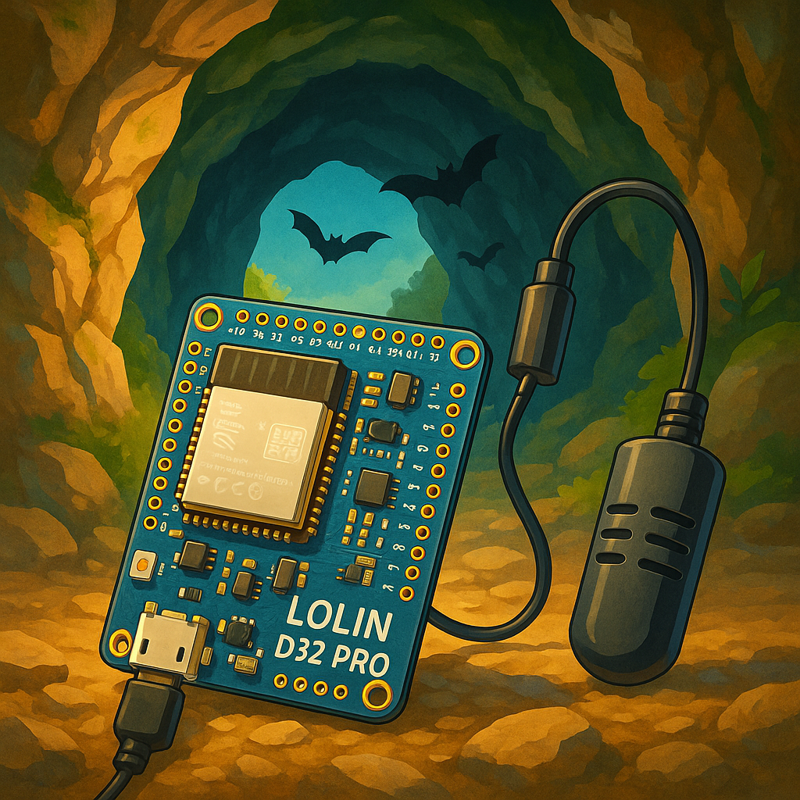

# 🦇 Projet de Datalogger Température & Humidité pour Cavités à Chiroptères



> A aller voir ..... [Angular Chiro App](https://github.com/themaire/angular_chiro_app) - PWA pour la récupération des données via Bluetooth BLE
>
> 💡 **Qu'est-ce qu'une PWA ?**  
> Une Progressive Web App (PWA) est une application web qui fonctionne comme une app mobile native. Elle peut être installée sur smartphone, fonctionne hors-ligne, accède aux APIs natives (Bluetooth, géolocalisation...) et offre une expérience utilisateur fluide. Pas besoin de passer par les stores d'applications !

---

## 📑 Sommaire

- [🦇 Projet de Datalogger Température \& Humidité pour Cavités à Chiroptères](#-projet-de-datalogger-température--humidité-pour-cavités-à-chiroptères)
  - [📑 Sommaire](#-sommaire)
  - [🎯 Objectif](#-objectif)
  - [🧪 Contexte scientifique](#-contexte-scientifique)
  - [⚙️ Spécifications techniques du dispositif](#️-spécifications-techniques-du-dispositif)
    - [Matériel principal](#matériel-principal)
    - [Matériel principal](#matériel-principal-1)
    - [Fonctionnement logiciel](#fonctionnement-logiciel)
      - [🔁 Mode normal (acquisition)](#-mode-normal-acquisition)
      - [🔋 Deep Sleep - Optimisation énergétique](#-deep-sleep---optimisation-énergétique)
  - [🗂️ Système SPIFFS - Tampon flash intelligent](#️-système-spiffs---tampon-flash-intelligent)
    - [📍 Principe technique](#-principe-technique)
    - [💾 Layout flash ESP32-C3](#-layout-flash-esp32-c3)
    - [🎯 Utilisation dans Chiro Logger](#-utilisation-dans-chiro-logger)
    - [✨ Avantages pour l'autonomie](#-avantages-pour-lautonomie)
  - [💡 Innovation RTC : Compteur persistant entre deep sleeps](#-innovation-rtc--compteur-persistant-entre-deep-sleeps)
    - [🧠 RTC Memory de l'ESP32 - Fonctionnement](#-rtc-memory-de-lesp32---fonctionnement)
    - [🔧 Implémentation technique](#-implémentation-technique)
    - [🎯 Gestion intelligente des resets](#-gestion-intelligente-des-resets)
  - [🏗️ Architecture modulaire du code](#️-architecture-modulaire-du-code)
    - [📁 Structure des modules](#-structure-des-modules)
    - [🎨 Module LED RGB (led\_rgb.h/c)](#-module-led-rgb-led_rgbhc)
    - [💾 Module SD Card (sd\_card.h/c)](#-module-sd-card-sd_cardhc)
    - [🔋 Module Batterie (battery.h/c)](#-module-batterie-batteryhc)
    - [🕐 Module RTC DS1307 (rtc\_clock.h/c)](#-module-rtc-ds1307-rtc_clockhc)
    - [🌡️ Module Capteur SHT45 (sht45.h/c)](#️-module-capteur-sht45-sht45hc)
    - [⚙️ Configuration globale (config.h)](#️-configuration-globale-configh)
    - [🔧 Intégration dans CMakeLists.txt](#-intégration-dans-cmakeliststxt)
    - [✨ Bénéfices de la refactorisation](#-bénéfices-de-la-refactorisation)
  - [�️ Configuration de l'environnement de développement](#️-configuration-de-lenvironnement-de-développement)
    - [📋 Prérequis](#-prérequis)
    - [🚀 Étapes d'installation](#-étapes-dinstallation)
      - [1. Cloner le projet](#1-cloner-le-projet)
      - [2. Vérifier le fichier `platformio.ini`](#2-vérifier-le-fichier-platformioini)
      - [3. Nettoyer les configurations précédentes](#3-nettoyer-les-configurations-précédentes)
      - [4. Installer les dépendances et compiler](#4-installer-les-dépendances-et-compiler)
      - [5. Configurer l'IDE VS Code](#5-configurer-lide-vs-code)
      - [6. Flasher sur la carte](#6-flasher-sur-la-carte)
    - [🔧 Commandes utiles](#-commandes-utiles)
    - [🐛 Dépannage](#-dépannage)
    - [📦 Structure du projet](#-structure-du-projet)
  - [�📡 Mode transfert Bluetooth BLE](#-mode-transfert-bluetooth-ble)
    - [🔄 Récupération des données sans contact](#-récupération-des-données-sans-contact)

---

## 🎯 Objectif

Concevoir et déployer un **datalogger autonome et discret** permettant la mesure **long terme** de la **température** et l’**humidité** dans des **cavités naturelles** ou souterraines **occupées par des chauves-souris (chiroptères)**.

L’objectif est de récolter des données environnementales précises, sans perturber les conditions locales, afin de mieux comprendre les dynamiques microclimatiques des sites d’hivernage.

## 🧪 Contexte scientifique

Dans les études de suivi des chiroptères, la précision des mesures et la **non-perturbation du milieu** sont essentielles. De simples variations dues à l'ouverture d’un boîtier peuvent créer des artefacts dans les séries de données, voire impacter le comportement des individus. Il est donc nécessaire que :

- L’appareil soit **étanche et totalement autonome**
- Les mesures soient **horodatées** avec précision
- Les données soient **récupérables sans contact physique**

## ⚙️ Spécifications techniques du dispositif

### Matériel principal

### Matériel principal

| Composant | Rôle | Remarques |
|----------|------|-----------|
| **[LOLIN C3 Mini (ESP32-C3)](https://fr.aliexpress.com/item/1005004866531117.html)** | Microcontrôleur principal | Ultra faible consommation (~5µA en deep sleep), BLE 5.0, architecture RISC-V, chargeur batterie intégré |
| **Shield RTC + microSD (DS1307)** | Horloge + stockage combinés | Module tout-en-un : DS1307 RTC pour horodatage + lecteur microSD pour stockage CSV - montage compact sur une seule plaquette |
| **SHT45** | Capteur de température et humidité | Haute précision industrielle, I2C, très faible consommation (<0.1µA en veille) |
| **LED RGB WS2812** | Feedback visuel optionnel | LED RGB addressable sur GPIO7, pilotée via RMT, désactivable pour économie batterie (mode VISUAL_MODE) |
| **Batterie LiPo 3.7V (≥1000mAh)** | Alimentation autonome | Chargeur intégré dans le LOLIN C3 Mini, autonomie estimée à plusieurs mois/années |
| **Boutons tactiles étanches** | Déclencheurs sans ouverture | Activation mode transfert BLE + vérification charge batterie |
| **Connecteur USB-C étanche** | Recharge sans ouverture | Le chargeur de batterie est intégré au LOLIN C3 Mini. Le connecteur est soudé aux à l'entrée 5V de la carte. |

### Fonctionnement logiciel

#### 🔁 Mode normal (acquisition)

- Réveil toutes les X minutes (configurable)
- Lecture des capteurs SHT45 + tension batterie
- Horodatage via RTC
- Enregistrement sur carte SD au format CSV
- Remise en sommeil profond (deep sleep)

#### 🔋 Deep Sleep - Optimisation énergétique

Le datalogger utilise le **mode deep sleep** de l'ESP32 pour maximiser l'autonomie :

**⚡ Consommation mesurée :**

- **Mode actif** (mesure + écriture tampon) : ~80-120 mA pendant 1-2 secondes
- **Mode deep sleep** : ~10-20 µA (microampères)
- **Économie d'énergie** : >99% du temps en veille

**🧪 Tests d'autonomie réels :**

**🔋 Test initial (mode debug) :**

- **Batterie testée** : LiPo 150mAh seulement
- **Configuration** : Mesures toutes les 5 secondes
- **Résultat** : **3700 mesures** jusqu'à épuisement total
- **Durée** : ~5 heures de fonctionnement continu

**🚀 Test optimisé (mode production ultra-silencieux) :**

- **Batterie testée** : LiPo 150mAh (même batterie)
- **Configuration** : Mesures toutes les 5 secondes
- **Résultat** : **6714 mesures** jusqu'à épuisement total ✨
- **Durée** : **~9h20** de fonctionnement continu (6714 × 5s)
- **Amélioration** : **+81% d'autonomie** grâce aux optimisations !

**📊 Projections d'autonomie :**

Basées sur les **résultats réels optimisés**, voici les estimations d'autonomie selon la batterie et l'intervalle de mesure :

| Batterie | Intervalle 5s | Intervalle 30min | Intervalle 1h |
|----------|---------------|------------------|---------------|
| **150mAh** | **9h20** (6714 mesures) | **~4 mois** | **~8 mois** |
| **500mAh** | **~31h** | **~13 mois** | **~26 mois** |
| **1000mAh** | **~62h** | **~26 mois** | **~52 mois** |
| **2000mAh** | **~124h** | **~52 mois** | **~104 mois** |

> 🦇 **Performance exceptionnelle :** Avec une batterie de 1000mAh et un intervalle de 30 minutes, le datalogger peut fonctionner **plus de 2 ans** dans une cavité !

**📊 Gestion intelligente des données avec tampon flash :**

Le datalogger utilise un système de **tampon flash interne** pour optimiser l'utilisation de la carte SD :

1. **Stockage temporaire** : Les mesures sont d'abord stockées dans la **flash interne de l'ESP32** (partition SPIFFS de 15MB)
2. **Économie d'énergie** : La carte SD n'est activée que lors du **flush périodique**
3. **Flush automatique** : Transfert des données vers la SD toutes les **500 mesures** (optimisé)

## 🗂️ Système SPIFFS - Tampon flash intelligent

**SPIFFS** (SPI Flash File System) est un **système de fichiers** spécialement conçu pour les puces de mémoire flash comme celles des ESP32.

### 📍 Principe technique

- **Flash interne** : Utilise directement la flash de l'ESP32 (pas de carte SD)
- **Usure uniforme** : Répartit les écritures sur toute la partition pour éviter l'usure
- **Résistant aux pannes** : Supporte les coupures de courant inattendues
- **API standard** : Fonctions POSIX (fopen, fwrite, fread, etc.)

### 💾 Layout flash ESP32-C3

```
Flash ESP32-C3 (4MB total) :
├── Bootloader     (~64KB)
├── Partitions     (~4KB) 
├── nvs            (~24KB)     # Stockage clé-valeur
├── otadata        (~8KB)      # OTA updates
├── app0           (~1.5MB)    # Firmware principal
├── app1           (~1.5MB)    # Firmware backup (OTA)
└── data_buffer    (~960KB)    # 🎯 PARTITION SPIFFS TAMPON
```

### 🎯 Utilisation dans Chiro Logger

**Tampon de données rapide :**
```c
// Écriture dans la flash interne (ultra-rapide)
FILE *buffer_file = fopen("/buffer/data_buffer.csv", "a");
fprintf(buffer_file, "%d,%.2f,%.2f,%d,%.2f\n", id, temp, hum, bat_pct, bat_v);
fclose(buffer_file);
```

**Transfert périodique vers SD :**
```c
// Transfert tampon → SD toutes les 500 mesures
FILE *src = fopen("/buffer/data_buffer.csv", "r");
FILE *dest = fopen("/sdcard/CHIRO/data.csv", "a");
// Copie et vide le tampon
```

### ✨ Avantages pour l'autonomie

1. **🚀 Performance** : Flash interne = lecture/écriture très rapide
2. **🔋 Économie d'énergie** : SD activée seulement toutes les 500 mesures
3. **🛡️ Fiabilité** : Données préservées même si SD absente/défaillante
4. **📊 Buffer intelligent** : Accumule les mesures avant transfert SD
5. **⚡ Deep sleep optimisé** : Réveils courts pour écrire en flash

> 💡 **Résultat :** SPIFFS donne un "disque dur virtuel" dans la flash de l'ESP32, parfait pour un tampon de données robuste et ultra-rapide !

**🕒 Timing avec mesures toutes les 5 secondes :**

- **Mesures 1-499** : Stockées dans le tampon flash
- **Mesure 500** : Déclenchement du flush → activation SD → transfert des 500 mesures → extinction SD
- **Cycle suivant** : Reprend avec le tampon vide

**⚡ Économie d'énergie réalisée :**

- **Sans tampon** : SD activée à chaque mesure (5s) = 720 activations/heure
- **Avec tampon** : SD activée toutes les 500 mesures = 1 activation toutes les **42 heures**
- **Réduction** : **99.8% d'activations SD en moins** = autonomie considérablement prolongée

**🔍 Monitoring dans les logs :**

```text
📊 Tampon: 499/500 mesures
📊 Tampon: 500/500 mesures
🔄 Seuil atteint - flush vers la carte SD...
📊 Flush de 500 mesures vers la SD
✅ 500 lignes copiées vers la SD
🧹 Tampon flash vidé
✅ Flush réussi - tampon vidé
```

**💾 Fiabilité des données :**

- Données sécurisées dans la flash interne (persistante après coupure)
- Mode dégradé automatique : écriture directe sur SD si tampon indisponible
- Aucune perte de données même en cas de problème SD temporaire

**⚡ Économie d'énergie réalisée :**

- **Sans tampon** : SD activée à chaque mesure (5s) = 720 activations/heure
- **Avec tampon** : SD activée toutes les 500 mesures = 1 activation toutes les **42 heures**
- **Réduction** : **99.8% d'activations SD en moins** = autonomie considérablement prolongée

- Mode actif : ~80 mA
- Deep sleep : ~10 µA (8000x moins !)

**🎨 Feedback visuel LED RGB (VISUAL_MODE) :**

Le datalogger intègre une **LED RGB WS2812** (GPIO7) pour un feedback visuel intelligent en phase de développement et de test :

**📊 Signaux visuels par couleur :**

- 🔵 **Bleu pulsé** : Démarrage système (3 pulsations)
- 🟢 **Vert flash** : Mesure enregistrée dans le tampon flash
- 🔵 **Cyan→Vert** : Flush en cours vers la carte SD
- 🟠 **Orange** : Mode transfert BLE actif
- 🔴 **Rouge** : Erreur détectée (capteur, SD, etc.)
- 🔵 **Bleu dim** : Entrée en deep sleep (fade progressif)

**🚨 Signaux d'erreur critique (force_display = true) :**

- 🔴 **Rouge clignotant rapide** : Carte SD inaccessible (10 flashs / 5s)
- 🔴 **Rouge fixe long** : Données perdues - tampon et SD indisponibles
- 🔴 **Rouge pulsé** : Capteur I2C défaillant

> 💡 **Note :** Les signaux d'erreur critique s'affichent **même en mode PRODUCTION** (VISUAL_MODE désactivé) pour garantir la visibilité des pannes critiques sur le terrain.

**⚡ Mode VISUAL_MODE - Optimisation batterie :**

La LED RGB peut être **totalement désactivée** pour maximiser l'autonomie en mission longue durée :

```c
// Mode debug/test : LED actives (défaut)
#define VISUAL_MODE

// Mode terrain : LED désactivées (décommenter)
// #define VISUAL_MODE
```

**📉 Économies mesurées avec VISUAL_MODE désactivé :**

- **RAM économisée** : -772 octets (10 348 → 9 576 bytes)
- **Flash économisée** : -15 712 octets (352 726 → 337 014 bytes)
- **Consommation LED** : 0 mA (vs ~1-20 mA selon intensité)
- **Usage recommandé** : VISUAL_MODE commenté pour déploiements terrain >1 mois

**🔧 Implémentation technique :**

- **Driver** : RMT (Remote Control Transceiver) à 10MHz pour timing précis WS2812
- **Protocole** : Encodage 24 bits GRB (800 kHz) via copy encoder
- **API simplifiée** : `set_led_rgb(r, g, b, duration_ms, blink_count, blink_period_ms)`
- **Compilation conditionnelle** : Toutes les fonctions LED désactivées si VISUAL_MODE non défini

Ce système permet de **debugger visuellement sur le terrain** tout en garantissant une **autonomie maximale** en production.

## 💡 Innovation RTC : Compteur persistant entre deep sleeps

🚀 **Pourquoi c'est techniquement révolutionnaire :**

La plupart des dataloggers "oublient" combien de mesures ils ont effectuées à chaque réveil. Ce datalogger utilise la **RTC Memory** de l'ESP32 pour maintenir un **compteur global persistant** !

### 🧠 RTC Memory de l'ESP32 - Fonctionnement

La **RTC Memory** est une **zone de RAM spéciale** (8KB) dans l'ESP32 qui :

- **Survit au deep sleep** : Alimentée en continu par le RTC (Real-Time Clock)
- **Consommation ultra-faible** : ~1-2 µA (inclus dans la consommation deep sleep)
- **Accès rapide** : RAM normale, pas de flash/EEPROM lente
- **Reset lors du redémarrage complet** : Mais PAS lors des réveils de deep sleep
- **Persistent entre cycles** : Variable maintenue pendant des semaines/mois

### 🔧 Implémentation technique

**Déclaration persistante :**
```c
// Variable stockée en RTC Memory - survit au deep sleep !
RTC_DATA_ATTR int cycle_counter = 0;

// À chaque réveil de deep sleep :
cycle_counter++;  // Le compteur continue de compter !
ESP_LOGI(TAG, "📊 Cycle de mesure #%d", cycle_counter);

// L'ID est utilisé comme première colonne du CSV
add_to_flash_buffer(cycle_counter, datetime_str, temp, humidity, battery_pct, battery_volt);
```

### 🎯 Gestion intelligente des resets

**✅ Réveil normal (deep sleep) :**
```text
Démarrage système:    cycle_counter = 0
1er réveil:          cycle_counter = 1 ✅
2ème réveil:         cycle_counter = 2 ✅
1000ème réveil:      cycle_counter = 1000 ✅
```

**🔄 Reset complet (redémarrage/coupure) :**
```text
Démarrage système:    Lecture du dernier ID depuis SD
Initialisation:      cycle_counter = max_id_from_SD
1er réveil:          cycle_counter = max_id + 1 ✅
```

**🛠️ Fonction de continuité :**
```c
// Au démarrage initial, lire l'ID max depuis la SD
esp_err_t init_cycle_counter_from_sd(void) {
    // Si SD disponible, trouve le dernier ID
    // Sinon, démarre à 0
    cycle_counter = max_id_found;
}
```

**📄 Format CSV enrichi :**

Le fichier CSV généré contient maintenant un **ID unique croissant** pour chaque mesure :

```csv
ID,DateTime,Temperature_C,Humidity_%,Battery_%,Battery_V
1,2026-02-07 08:00:00,18.50,85.0,95,4.12
2,2026-02-07 08:30:00,18.60,85.2,95,4.11
3,2026-02-07 09:00:00,18.70,85.4,94,4.10
...
1247,2026-03-15 14:30:00,19.20,86.1,58,3.78
```

**✨ Avantages uniques :**

- **Numérotation continue** : Cycles #1, #2, #3... même après des semaines
- **ID unique dans CSV** : Chaque mesure a un identifiant permanent et croissant
- **Diagnostic précis** : "Le datalogger a effectué exactement 1247 mesures"  
- **Détection de pertes** : Si l'ID saute de 100 à 110, on sait que 9 mesures manquent
- **Consommation nulle** : La RTC Memory ne consomme que quelques µA
- **Fiabilité totale** : Reset uniquement lors d'un redémarrage complet

**📊 Dans les logs :**

```text
⏰ Réveil du deep sleep (timer) - Cycle #1247
📊 Compteur RTC persistant: 1246 ✨ (survit depuis le début!)
📊 Cycle de mesure #1247
💾 CSV: ID=1247, T=19.2°C, H=86.1%
```

> 💡 **Magie technique :** Même après 1000 réveils de deep sleep, le système sait parfaitement qu'il en est à sa 1000ème mesure !

**�🔄 Cycle de fonctionnement avec compteur persistant :**

```text
🚀 Démarrage initial du système - Reset du compteur
📊 Compteur RTC persistant: 0
📊 Cycle de mesure #1
💡 LED: 1 clignotement (mesure ajoutée au tampon)
🌡️  Mesure: T=18.7°C, H=85.4%
� Mesure stockée dans le tampon flash
📊 Tampon: 1/500 mesures
💤 Entrée en deep sleep pour 5 secondes...
    [5 secondes plus tard - REDÉMARRAGE COMPLET]
⏰ Réveil du deep sleep (timer) - Cycle #2
📊 Compteur RTC persistant: 1
📊 Cycle de mesure #2
💡 LED: 1 clignotement (mesure ajoutée au tampon)
🌡️  Mesure: T=18.9°C, H=85.8%
� Tampon: 2/5 mesures
    [... cycles 3, 4...]
📊 Cycle de mesure #5
📊 Tampon: 5/5 mesures
🔄 Seuil atteint - flush vers la carte SD...
💡 LED: 10 clignotements rapides (flush SD)
✅ Flush réussi - tampon vidé
💤 Entrée en deep sleep pour 5 secondes...
    [cycle se répète avec compteur persistant...]
```

**🎛️ Configuration optimisée :**

- **Délai actuel** : `DEEP_SLEEP_DURATION_SEC = 5` (pour tests rapides)
- **Suggestions déploiement** :
  - **30 minutes** (1800s) : Monitoring climatique standard - **Autonomie 2+ mois**
  - **1 heure** (3600s) : Surveillance long terme - **Autonomie 4+ mois**
  - **6 heures** (21600s) : Études saisonnières - **Autonomie 2+ ans**
- **Tampon flash** : `BUFFER_FLUSH_THRESHOLD = 500` (optimisé pour autonomie)
- **Mode production** : `#define PRODUCTION_MODE` pour désactiver les logs de debug

**⚡ Optimisation énergétique avancée :**

**📟 Gestion intelligente des logs :**

Les logs de débogage consomment de l'énergie ! Le datalogger utilise un système de **logs conditionnels** :

```c
// Mode développement : Tous les logs actifs
LOG_ESSENTIAL(TAG, "📊 Cycle #%d");    // Toujours affiché
LOG_DEBUG(TAG, "🔋 Mesure ajoutée");   // Affiché en développement
LOG_VERBOSE(TAG, "🔧 Détail debug");   // Affiché en développement

// Mode production : Logs essentiels uniquement
#define PRODUCTION_MODE  // Désactive DEBUG et VERBOSE
```

**⚡ Économie réalisée en production :**

- **Mode debug** : ~100 logs par cycle = +200ms d'activité
- **Mode production** : ~10 logs essentiels = +50ms d'activité  
- **Gain énergétique** : **75% de réduction** du temps d'activité des logs

**🚀 Mode production ULTRA-SILENCIEUX :**

Configuration finale pour **autonomie maximale** - tous les logs système ESP-IDF désactivés :

**📁 Configuration `sdkconfig.defaults` :**

```ini
# 🔋 OPTIMISATION ÉNERGÉTIQUE - DÉSACTIVATION COMPLÈTE DES LOGS SYSTÈME
CONFIG_LOG_DEFAULT_LEVEL_NONE=y
CONFIG_LOG_DEFAULT_LEVEL=0
CONFIG_BOOTLOADER_LOG_LEVEL_NONE=y  
CONFIG_BOOTLOADER_LOG_LEVEL=0
CONFIG_LOG_MAXIMUM_LEVEL=0
CONFIG_ESP_CONSOLE_UART_NONE=y
```

**🔧 Résultat de l'optimisation :**

**AVANT** (mode debug) :

```text
I (31) boot: ESP-IDF 5.3.1 2nd stage bootloader
I (31) boot: compile time Jul  7 2025 22:57:51
I (392) CHIRO_LOGGER: 🦇 Chiro Logger - Datalogger pour chiroptères
I (392) CHIRO_LOGGER: ⏰ Réveil du deep sleep (timer) - Cycle #4
I (1552) CHIRO_LOGGER: 📊 Cycle de mesure #4
```

**APRÈS** (mode production) :

```text
ets Jun  8 2016 00:22:57
rst:0x5 (DEEPSLEEP_RESET),boot:0x17 (SPI_FAST_FLASH_BOOT)
mode:DIO, clock div:2
entry 0x40080580
```

**🔍 Explication des messages restants :**

- **`ets Jun 8 2016`** : **ETS** = **Espressif Test Suite** (ROM bootloader)
- **Timestamp figé** : Date de compilation du firmware ROM d'Espressif (normal)
- **Messages ROM** : Viennent du **silicium ESP32**, **impossible à supprimer**
- **Impact énergétique** : **Négligeable** (~10ms d'affichage au réveil)

**⚡ Impact des optimisations énergétiques :**

L'amélioration spectaculaire de **+81% d'autonomie** démontre l'efficacité des optimisations :

**🔧 Optimisations appliquées :**

1. **Logs système ESP-IDF désactivés** : Plus de logs bootloader/système
2. **Logs applicatifs conditionnels** : Seuls les logs essentiels en production
3. **Tampon flash optimisé** : SD activée seulement 13 fois (6714÷500) vs 6714 fois
4. **Mode production silencieux** : Pas de gaspillage énergétique UART
5. **Deep sleep parfait** : Consommation < 10µA en veille

**📈 Comparaison des résultats :**

| Mode | Mesures | Durée | Amélioration |
|------|---------|-------|-------------|
| **Debug initial** | 3700 | ~5h | Baseline |
| **Production optimisé** | **6714** | **~9h20** | **+81%** |

**💡 Conclusion :** Les optimisations de logs et de gestion énergétique permettent de **quasi-doubler l'autonomie** !

## 🏗️ Architecture modulaire du code

Le firmware du Chiro Logger a été **entièrement refactorisé** pour une meilleure maintenabilité et réutilisabilité :

### 📁 Structure des modules

```
src/
├── main.c              # Logique principale
├── config.h            # Configuration globale partagée
├── led_rgb.h/c         # Module LED RGB WS2812
├── sd_card.h/c         # Module carte microSD
├── battery.h/c         # Module mesure batterie (ADC)
├── rtc_clock.h/c       # Module horloge RTC DS1307 (I2C)
├── sht45.h/c           # Module capteur SHT45 (température + humidité)
└── CMakeLists.txt      # Configuration build
```

### 🎨 Module LED RGB (led_rgb.h/c)

**Responsabilité :** Contrôle de la LED RGB WS2812 pour feedback visuel

```c
// API simplifiée avec gestion des erreurs critiques
esp_err_t init_led_rgb(void);
void set_led_rgb(uint8_t r, uint8_t g, uint8_t b, uint32_t duration_ms, 
                  uint8_t blink_count, uint32_t blink_period_ms, bool force_display);
void led_off(void);
void deinit_led_rgb(void);  // Extinction complète + verrouillage GPIO avant deep sleep
```

**Fonctionnalités :**
- Driver RMT optimisé pour timing WS2812 précis
- Support de VISUAL_MODE (compilation conditionnelle)
- Patterns de clignotement configurables
- Gestion automatique de l'encodage GRB 24 bits
- **🚨 Mode force_display** : Outrepasse VISUAL_MODE pour erreurs critiques
- **💤 Extinction propre avant deep sleep** via `deinit_led_rgb()`

**⚠️ Piège hardware : LED qui reste allumée en deep sleep**

La LED WS2812 est alimentée en **3.3V en permanence** (même quand le CPU dort). Quand l'ESP32-C3 entre en deep sleep, tous les GPIOs passent en **état flottant** (haute impédance). Le WS2812, qui reste sous tension, interprète ce bruit électrique sur sa ligne de données (GPIO7) et réaffiche une couleur parasite — typiquement du bleu.

En Python/MicroPython, un simple `pin.value(0)` suffirait. En C bare-metal sur ESP-IDF, il faut orchestrer **4 opérations** dans le bon ordre :

```c
void deinit_led_rgb(void) {
    // 1. Envoyer 3× la trame "noir" (0,0,0) avec délais généreux
    //    pour être certain que le WS2812 latch bien la couleur noire
    for (int i = 0; i < 3; i++) {
        ws2812_send_pixel(0, 0, 0);
        vTaskDelay(pdMS_TO_TICKS(5));
    }
    
    // 2. Désactiver et libérer le canal RMT (sinon conflit au réveil)
    rmt_disable(led_chan);
    rmt_del_channel(led_chan);
    
    // 3. Reprendre le contrôle du GPIO et le forcer à LOW
    gpio_reset_pin(LED_RGB_PIN);
    gpio_set_direction(LED_RGB_PIN, GPIO_MODE_OUTPUT);
    gpio_set_level(LED_RGB_PIN, 0);
    
    // 4. VERROUILLER l'état LOW pendant tout le deep sleep
    //    Sans ça, le GPIO flotte dès que le CPU s'éteint !
    gpio_hold_en(LED_RGB_PIN);
}
```

**🔑 Le secret : `gpio_hold_en()`** — Cette fonction ESP-IDF **gèle** l'état électrique du GPIO pendant le deep sleep. Le pin reste physiquement tiré à LOW, empêchant le WS2812 de recevoir du bruit. Au réveil, `init_led_rgb()` appelle `gpio_hold_dis()` pour déverrouiller le GPIO avant de reconfigurer le canal RMT.

> 💡 **Leçon embarquée :** Sur un microcontrôleur, éteindre une LED adressable avant le deep sleep ne se résume pas à "envoyer du noir". Il faut aussi maîtriser l'état électrique du GPIO **après** l'extinction du CPU — un niveau de détail que les frameworks haut niveau masquent complètement.

**🔧 Paramètre force_display :**
```c
// Utilisation normale (respecte VISUAL_MODE)
set_led_rgb(0, 255, 0, 1000, 3, 300, false);  // Vert si VISUAL_MODE activé

// Erreur critique (FORCE l'affichage même en production)
set_led_rgb(255, 0, 0, 5000, 10, 250, true);  // Rouge FORCÉ même si VISUAL_MODE désactivé
```

**🎯 Cas d'usage force_display = true :**
- 🔴 **Carte SD inaccessible** : Signal critique au démarrage
- 🔴 **Capteur défaillant** : Indication de panne matérielle
- 🔴 **Corruption de données** : Alert système
- 🔴 **Batterie critique** : Warning avant arrêt

### 💾 Module SD Card (sd_card.h/c)

**Responsabilité :** Gestion complète de la carte microSD

```c
// API robuste
esp_err_t init_sd_card(void);
esp_err_t test_sd_card(void);
esp_err_t unmount_sd_card(void);
esp_err_t log_data_to_csv(const char* filepath, int id, const char* datetime, 
                          float temperature, float humidity, int battery_pct, float battery_volt);
```

**Fonctionnalités :**
- Configuration SPI automatique (pins ESP32-C3)
- Montage/démontage propre du système FAT
- Création automatique des répertoires
- Gestion d'erreurs complète avec diagnostics

**⚠️ Subtilité côté SPI :** Sur la LOLIN C3 Mini + shield microSD/RTC type D1 Mini, la carte ne monte pas si le bus SPI n'est pas initialisé **avant** l'appel à `esp_vfs_fat_sdspi_mount()`. Il faut d'abord appeler `spi_bus_initialize(SPI2_HOST, &bus_cfg, SPI_DMA_CH_AUTO)` avec la bonne cartographie (CLK=GPIO1, MISO=GPIO0, MOSI=GPIO4, CS=GPIO5), puis seulement monter la SD. Sans cette étape, le driver FAT n'initialise pas les GPIOs et renvoie des erreurs (timeouts ou `ESP_ERR_NO_MEM`).

**📚 Dépendances SDK utiles :** L'init s'appuie sur les headers ESP-IDF SPI/SDSPI (`driver/spi_master.h`, `driver/spi_common.h`, `driver/sdspi_host.h`) qui exposent `spi_bus_initialize()` et les macros `SDSPI_HOST_DEFAULT()` / `SDSPI_DEVICE_CONFIG_DEFAULT()` utilisées dans `sd_card.c`.

### 🔋 Module Batterie (battery.h/c)

**Responsabilité :** Mesure de la tension batterie LiPo via ADC

```c
// API batterie
esp_err_t init_battery(void);
esp_err_t read_battery(battery_info_t *info);  // voltage (V) + pourcentage (%)
esp_err_t deinit_battery(void);
```

**Fonctionnalités :**
- Lecture ADC1 canal 3 (GPIO3) avec atténuation 12dB
- **Calibration automatique** via curve fitting (ESP32-C3)
- Moyennage sur 16 lectures pour stabilité
- Prise en compte du **diviseur de tension ×2** (100K/100K du LOLIN C3 Mini)
- Conversion en pourcentage : **4.15V = 100%**, 3.0V = 0% (seuil calibré sur batterie LiPo 3000mAh neuve)
- Libération immédiate de l'ADC après lecture (économie deep sleep)

**📊 Utilisation dans app_main :**
```c
battery_info_t bat;
int battery_pct = -1;       // -1 = lecture indisponible
float battery_volt = -1.0f; // -1.0 = lecture indisponible

init_battery();
if (read_battery(&bat) == ESP_OK) {
    battery_pct = bat.percentage;
    battery_volt = bat.voltage;
}
deinit_battery();
```

**📈 Données batterie dans le CSV :**

Chaque mesure enregistrée inclut **deux colonnes batterie** :

| Colonne | Type | Valeur N/A | Description |
|---------|------|------------|-------------|
| `Battery_%` | int | `N/A` | Pourcentage estimé (approximation linéaire 4.15V→3.0V) |
| `Battery_V` | float | `N/A` | Tension brute mesurée en Volts |

```csv
ID,DateTime,Temperature_C,Humidity_%,Battery_%,Battery_V
1,2026-02-07 14:30:00,19.85,52.30,78,3.92
2,2026-02-07 15:00:00,19.72,53.10,77,3.90
...
500,2026-02-18 10:30:00,18.40,86.20,42,3.68
```

**🔬 Pourquoi stocker les deux valeurs ?**

Le pourcentage est une **estimation calculée** à partir d'une courbe de décharge théorique. La tension brute est la **donnée physique réelle**. Stocker les deux permet :

- **📉 Tracer la courbe de décharge réelle** de la batterie dans les conditions terrain (température de la cavité, cycles deep sleep)
- **🔍 Détecter le vieillissement** : une batterie usée présente une tension nominale plus basse à pourcentage équivalent
- **🔧 Recalibrer la conversion V→%** : les données réelles permettent d'affiner la courbe de conversion pour les futures missions
- **🌡️ Corréler température et autonomie** : le froid des cavités (~10-15°C) affecte la capacité des LiPo, les données CSV permettront de quantifier cet impact

**⚠️ Approximation linéaire actuelle :**

La conversion V→% utilise actuellement une **interpolation linéaire** entre 4.15V (100%) et 3.0V (0%). Or une batterie LiPo se décharge selon une **courbe en S** caractéristique :

```
Tension (V)
4.15 ┤▓▓▓▓▓▓▓▓▓▓▓▓▓░░░░░░░░░░░░░░░░░░░░░░░░░░  ← Chute rapide initiale
3.90 ┤             ▓▓▓▓▓▓▓▓▓▓▓░░░░░░░░░░░░░░░░░░
3.80 ┤                        ▓▓▓▓▓▓▓▓▓▓▓▓▓▓▓▓░░  ← Long plateau ~3.7V
3.70 ┤                                         ▓▓
3.50 ┤                                          ▓  ← Chute brutale
3.00 ┤                                          ▓  ← Coupure
     └──────────────────────────────────────────────
     100%                                      0%
```

Conséquence avec la courbe linéaire : le **% affiché chute trop vite au début** (4.15→3.8V) et **trop lentement au milieu** (long plateau ~3.7V). C'est acceptable pour le moment, car la tension brute (`Battery_V`) est stockée dans le CSV pour une analyse post-traitement précise.

**📋 TODO — Courbe de décharge réelle :**

> 🔬 **Objectif :** Après une première **décharge complète sur le terrain** (batterie LiPo 3000mAh, deep sleep cyclique), analyser les colonnes `Battery_V` et `Battery_%` du CSV pour :
>
> 1. **Tracer la courbe V = f(temps)** réelle en conditions d'utilisation (température cavité, cycles deep sleep)
> 2. **Identifier les seuils clés** : début du plateau, fin du plateau, tension de coupure effective
> 3. **Remplacer l'interpolation linéaire** par une courbe multi-segments ou polynomiale calibrée sur les données réelles :
>    ```c
>    // Exemple futur : conversion LiPo multi-segments
>    if (voltage >= 4.00f) percentage = map(voltage, 4.00, 4.15, 90, 100);
>    else if (voltage >= 3.75f) percentage = map(voltage, 3.75, 4.00, 40, 90);  // plateau
>    else if (voltage >= 3.50f) percentage = map(voltage, 3.50, 3.75, 10, 40);
>    else percentage = map(voltage, 3.00, 3.50, 0, 10);  // chute finale
>    ```
> 4. **Corréler avec la température** : évaluer l'impact du froid sur la capacité effective
> 5. **Valider sur plusieurs cycles** : comparer les courbes de décharge successives pour détecter le vieillissement
>
> **Données nécessaires :** Un CSV complet d'une décharge 100%→0% en conditions réelles (intervalle 30min, batterie 3000mAh).

> 💡 **À terme :** Les valeurs batterie seront transmises via BLE à l'appli Angular pour affichage du niveau de charge et analyse statistique de l'usure.

### 🕐 Module RTC DS1307 (rtc_clock.h/c)

**Responsabilité :** Horodatage précis des mesures via le DS1307 du shield SD/RTC

```c
// API RTC
esp_err_t init_rtc(void);                              // Init I2C + vérif oscillateur
esp_err_t rtc_get_time(rtc_time_t *time);              // Lire date/heure
esp_err_t rtc_set_time(const rtc_time_t *time);        // Programmer date/heure
esp_err_t rtc_set_time_from_compile(void);             // Auto-programmation
void rtc_format_datetime(const rtc_time_t *time, char *buf, size_t len);
esp_err_t deinit_rtc(void);
```

**Fonctionnalités :**
- Communication I2C avec le DS1307 (adresse 0x68, SDA=GPIO8, SCL=GPIO10)
- Lecture/écriture des 7 registres temps en une seule transaction I2C
- Conversion BCD ↔ décimal automatique
- Calcul automatique du jour de la semaine (algorithme de Sakamoto)
- Détection oscillateur arrêté (bit CH) pour savoir si l'heure est valide

**⏰ Mise à l'heure automatique :**

Le DS1307 est maintenu par une **pile CR2032** sur le shield, mais il doit être programmé au moins une fois. Le firmware utilise une stratégie **auto-détection** :

1. Au boot, il lit l'heure du DS1307
2. Si l'année est **< 2024** (RTC vierge ou pile changée) → il programme automatiquement la **date/heure de compilation** (`__DATE__` / `__TIME__`)
3. Si l'année est **≥ 2024** → il ne touche à rien (la pile a maintenu l'heure)

```c
// Logique dans app_main()
rtc_time_t now;
rtc_get_time(&now);
if (now.year < 2024) {
    rtc_set_time_from_compile();  // Auto-programmation
    rtc_get_time(&now);           // Relire
}
// Affiche: 🕐 RTC: 2026-02-06 14:30:05
```

> 💡 **Précision :** Décalage de ~10-30s max (temps de flash après compilation). La pile CR2032 maintient ensuite l'heure indéfiniment. Plus tard, le BLE permettra une synchronisation à la seconde près depuis l'appli Angular.

**📚 Bus I2C partagé :** Le bus I2C (SDA=GPIO8, SCL=GPIO10) est **partagé avec le capteur SHT45** (adresse 0x44). Le module RTC expose le handle du bus via `rtc_get_i2c_bus()` pour que le SHT45 puisse s'y rattacher sans recréer le bus.

### 🌡️ Module Capteur SHT45 (sht45.h/c)

**Responsabilité :** Mesure de la température et de l'humidité via le capteur Sensirion SHT45

```c
// API SHT45
esp_err_t init_sht45(i2c_master_bus_handle_t bus_handle);  // Init sur bus I2C existant
esp_err_t read_sht45(sht45_data_t *data);                  // Lecture temp (°C) + humidité (%)
esp_err_t deinit_sht45(void);                              // Libération du device I2C
```

**Fonctionnalités :**
- Communication I2C avec le SHT45 (adresse 0x44, bus partagé avec DS1307)
- Mesure **haute précision** (commande 0xFD) : ±0.1°C / ±1% RH
- **Vérification CRC-8** (polynôme 0x31) sur chaque valeur reçue
- **Retry automatique** avec backoff (3 tentatives, 10 ms entre chaque) en cas de NACK
- **Soft reset** du capteur à l'initialisation pour état propre
- **Calibration configurable** via offsets dans `config.h`
- Fallback sur valeurs simulées si capteur indisponible

**🔗 Partage du bus I2C :**

Le SHT45 ne crée pas son propre bus I2C. Il se rattache au bus existant créé par le module RTC :

```c
// Séquence dans app_main()
init_rtc();                                    // 1. Crée le bus I2C + init DS1307
i2c_master_bus_handle_t bus = rtc_get_i2c_bus(); // 2. Récupère le handle du bus
init_sht45(bus);                               // 3. Ajoute le SHT45 sur le même bus
read_sht45(&data);                             // 4. Lecture température + humidité
deinit_sht45();                                // 5. Retire le SHT45 du bus
deinit_rtc();                                  // 6. Détruit le bus I2C
```

**🔧 Calibration :**

Les offsets de calibration sont définis dans `config.h` et appliqués automatiquement après conversion :

```c
#define SHT45_TEMP_OFFSET     -1.7f  // Correction température en °C
#define SHT45_HUMIDITY_OFFSET  0.0f   // Correction humidité en %RH
```

> 💡 **Astuce calibration :** Comparer la sonde avec un thermomètre de référence, puis ajuster `SHT45_TEMP_OFFSET` dans `config.h`. Pas besoin de modifier le code du driver.

**🧪 Mode test (TEST_SHT45) :**

Un mode de test dédié permet de valider le capteur sur breadboard sans le shield RTC/SD :

```c
// Décommenter dans config.h pour activer
#define TEST_SHT45
```

Ce mode crée un `app_main()` simplifié qui :
- Initialise le bus I2C directement (pas besoin du DS1307)
- Lit la sonde en boucle toutes les 2 secondes
- Affiche un tableau formaté sur le moniteur série

```text
🧪 === MODE TEST SHT45 ===
✅ Bus I2C initialisé
✅ SHT45 détecté - Début des lectures (toutes les 2s)
  #  |  Température  |  Humidité
-----|--------------|----------
  1  |    20.05 °C   |  47.77 %
  2  |    20.07 °C   |  47.72 %
```

### ⚙️ Configuration globale (config.h)

**Responsabilité :** Centralisation de tous les paramètres

```c
// Modes de compilation
// #define TEST_SHT45       // Mode test sonde (lecture en boucle sur moniteur série)
#define VISUAL_MODE         // Active/désactive les LEDs
// #define PRODUCTION_MODE  // Mode logs minimaux

// Paramètres système
#define DEEP_SLEEP_DURATION_SEC 5
#define BUFFER_FLUSH_THRESHOLD 20
#define WAKEUP_BUTTON_PIN GPIO_NUM_2

// Bus I2C (RTC DS1307 + SHT45)
#define I2C_SDA_PIN  8   // D2 → GPIO8
#define I2C_SCL_PIN  10  // D1 → GPIO10

// Calibration SHT45 (offsets ajoutés aux valeurs brutes)
#define SHT45_TEMP_OFFSET     -1.7f  // Correction température en °C
#define SHT45_HUMIDITY_OFFSET  0.0f   // Correction humidité en %RH
```

**Avantages :**
- Configuration partagée entre tous les modules
- Compilation conditionnelle centralisée
- Paramètres facilement modifiables
- Calibration capteur ajustable sans toucher au code

### 🔧 Intégration dans CMakeLists.txt

```cmake
idf_component_register(
    SRCS "main.c" "led_rgb.c" "sd_card.c" "battery.c" "rtc_clock.c" "sht45.c"
    INCLUDE_DIRS "."                        # Headers locaux
    REQUIRES driver esp_timer fatfs sdmmc spiffs esp_adc
)
```

### ✨ Bénéfices de la refactorisation

**🧹 Code plus propre :**
- main.c réduit de ~890 à ~320 lignes
- Séparation claire des responsabilités
- Réduction de la complexité cognitive

**🔄 Réutilisabilité :**
- Modules indépendants réutilisables
- APIs documentées et cohérentes
- Tests modulaires possibles

**🚀 Maintenabilité :**
- Modifications localisées par fonctionnalité
- Debugging simplifié
- Ajout de nouvelles fonctions facilité

**📦 Extensibilité future :**
- Ajout facile de nouveaux capteurs (I2C, SPI...)
- Intégration BLE modulaire
- Support multi-plateformes (ESP32 classique ↔ ESP32-C3)

Cette architecture modulaire facilite grandement le développement et la maintenance du projet !

## �️ Configuration de l'environnement de développement

### 📋 Prérequis

-- J'ai constitué ce projet sur MacOS 15.1.1. Je ne saurais vous aider si vous etes sur un systeme d'exploitation different.

- **VS Code** avec l'extension **PlatformIO IDE**
- **Python 3.x** installé
- **Git** pour cloner le projet

### 🚀 Étapes d'installation

#### 1. Cloner le projet

```bash
git clone https://github.com/themaire/chiro_logger.git
cd chiro_logger
```

#### 2. Vérifier le fichier `platformio.ini`

Assurez-vous que la configuration correspond à votre carte :

```ini
[env:lolin_c3_mini]
platform = espressif32@6.9.0
board = lolin_c3_mini
framework = espidf
lib_deps = 
    esp-nimble-cpp
```

**Pour LOLIN D32 PRO (ESP32 classique) :**
```ini
[env:lolin_d32_pro_16mb]
platform = espressif32
board = lolin_d32_pro
framework = espidf
```

#### 3. Nettoyer les configurations précédentes

Si vous changez de carte ou rencontrez des erreurs :

```bash
# Supprimer les anciennes configurations
rm -f sdkconfig sdkconfig.lolin_c3_mini sdkconfig.lolin_d32_pro_16mb

# Nettoyer le build
pio run -t clean
```

#### 4. Installer les dépendances et compiler

```bash
# Mettre à jour les packages PlatformIO
pio pkg update

# Compiler le projet (installe automatiquement les dépendances)
pio run -t build
```

#### 5. Configurer l'IDE VS Code

```bash
# Générer la configuration pour IntelliSense
pio run -t compiledb
```

Puis recharger VS Code : `Cmd+Shift+P` → **"Developer: Reload Window"**

#### 6. Flasher sur la carte

```bash
# Upload du firmware
pio run -t upload

# Monitorer les logs série
pio device monitor
```

### 🔧 Commandes utiles

| Commande | Description |
|----------|-------------|
| `pio run -t clean` | Nettoyer le projet |
| `pio run -t build` | Compiler le firmware |
| `pio run -t upload` | Flasher sur l'ESP32 |
| `pio device monitor` | Monitorer les logs série |
| `pio run -t compiledb` | Régénérer la config IntelliSense |
| `pio pkg update` | Mettre à jour les dépendances |
| `pio device list` | Lister les ports série disponibles |

### 🐛 Dépannage

**Problème : Headers BLE non trouvés (`esp_bt_main.h` manquant)**

→ L'ESP32-C3 utilise NimBLE, pas le stack Bluedroid classique. Vérifiez que `lib_deps = esp-nimble-cpp` est dans `platformio.ini`.

**Problème : Erreur de compilation avec Xtensa sur ESP32-C3**

→ L'ESP32-C3 utilise RISC-V, pas Xtensa. Vérifiez que `board = lolin_c3_mini` est configuré.

**Problème : IntelliSense ne trouve pas les includes**

→ Lancez `pio run -t compiledb` puis rechargez VS Code.

**Problème : Port série non détecté**

→ Vérifiez les drivers USB-Serial (CH340, CP210x selon la carte).

### 📦 Structure du projet

```
chiro_logger/
├── 📁 src/                       # Code source principal
│   ├── 🎯 main.c                 # Logique principale
│   ├── ⚙️ config.h              # Configuration globale partagée
│   ├── 🎨 led_rgb.h/.c          # Module LED RGB WS2812 + RMT
│   ├── 💾 sd_card.h/.c          # Module carte SD SPI + FAT32
│   ├── 🔋 battery.h/.c          # Module mesure batterie (ADC)
│   ├── 🕐 rtc_clock.h/.c        # Module horloge RTC DS1307 (I2C)
│   ├── 🌡️ sht45.h/.c            # Module capteur SHT45 (I2C)
│   └── 🔧 CMakeLists.txt         # Configuration build ESP-IDF
├── 📁 components/                # Modules ESP-IDF externes
│   └── ble_transfer/             # Module BLE (à implémenter)
│       ├── ble_manager.h
│       ├── ble_manager.c
│       └── CMakeLists.txt
├── 📄 partitions.csv             # Layout flash (SPIFFS + OTA)
├── 📁 platformio.ini             # Configuration PlatformIO
├── 📄 sdkconfig.defaults         # Configuration ESP-IDF
└── 📄 README.md                  # Documentation complète
```

---

## �📡 Mode transfert Bluetooth BLE

### 🔄 Récupération des données sans contact

Le datalogger intègre un **mode transfert BLE** permettant de récupérer les données stockées **sans ouvrir le boîtier** :

**🎛️ Activation du mode transfert :**

- **Déclencheur** : Appui sur bouton GPIO0 (BOOT) pendant le deep sleep
- **Réveil automatique** : L'ESP32 détecte l'appui et active le BLE
- **Service GATT** : Service personnalisé avec UUIDs 128 bits
  - **Service :** `12345678-1234-1234-1234-123456789ABC`
  - **Caractéristique données :** `87654321-4321-4321-4321-CBA987654321`
- **Publicité active** : Device visible comme "ChiroLogger"
- **Connexion PWA** : L'application web se connecte automatiquement

**⚡ Fonctionnement optimisé :**

- **Timeout intelligent** : Mode BLE actif pendant 5 minutes maximum
- **Retour automatique** : Retour en deep sleep après transfert ou timeout
- **Économie d'énergie** : BLE activé uniquement à la demande
- **Feedback LED** : Indication visuelle du mode actif

**📱 Compatibilité PWA :**

Le système fonctionne avec l'[Angular Chiro App](https://github.com/themaire/angular_chiro_app), une PWA qui :

- Se connecte automatiquement au datalogger via Web Bluetooth API
- Récupère et affiche les données CSV en temps réel  
- Fonctionne sur smartphone/tablette sans installation
- Permet l'export et l'analyse des données sur le terrain

**🛠️ Implémentation technique :**

```c
// Structure modulaire du composant BLE
components/ble_transfer/
├── ble_manager.h        // API publique + UUIDs
├── ble_manager.c        // Service GATT + callbacks + conversion UUID
└── CMakeLists.txt       // Dépendances BT (bt, nvs_flash)

// Conversion UUID correcte (little-endian pour ESP32)
static void uuid_string_to_bin(const char *uuid_str, uint8_t *uuid_bin);

// Séquence de connexion BLE
1. ESP_GATTS_REG_EVT -> Création service GATT
2. ESP_GATTS_CREATE_EVT -> Ajout caractéristique données  
3. ESP_GATTS_ADD_CHAR_EVT -> Service démarré
4. ESP_GATTS_CONNECT_EVT -> Client connecté, publicité arrêtée
5. ESP_GATTS_READ_EVT -> Envoi des données CSV

// Intégration dans main.c
esp_sleep_wakeup_cause_t wakeup_reason = esp_sleep_get_wakeup_cause();
if (wakeup_reason == ESP_SLEEP_WAKEUP_EXT0) {
    handle_transfer_mode();  // Mode BLE actif
} else {
    perform_measurement();   // Mode normal
}
```

**🔒 Sécurité et fiabilité :**

- **Données en lecture seule** : Aucune modification possible via BLE
- **Mode temporaire** : BLE désactivé en fonctionnement normal
- **Impact nul sur l'autonomie** : Mode transfert purement optionnel

Cette innovation permet une **récupération des données totalement non-intrusive**, essentielle pour les études sur terrain sensible.
